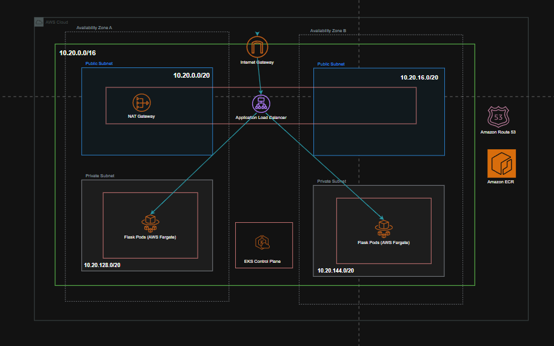

# 🚀 EKS Fargate GitOps: DevOps Take-Home

[](https://www.terraform.io/)
[](https://aws.amazon.com/eks/)
[](https://argoproj.github.io/cd/)
[](https://github.com/features/actions)

This repository implements a production-hardened **EKS Fargate** landing zone using a **Terraform-first** approach. It leverages **GitOps** for continuous delivery, ensuring that Git remains the single source of truth for both infrastructure and application state.

-----

## 🏗 Architecture Overview

The solution builds a high-availability environment across two Availability Zones, enforcing a strict public/private subnet split.

### **Component Map**

| Layer | Components | Purpose |
| :--- | :--- | :--- |
| **Network** | VPC, 2x Public/Private Subnets, NAT Gateway | Isolate workloads and provide secure egress. |
| **Compute** | EKS Fargate (Default & Kube-system profiles) | Serverless Kubernetes execution (no node management). |
| **Delivery** | Argo CD + Argo Image Updater | Automates deployment sync and ECR image promotion. |
| **Security** | Security Groups (ALB/Pod/Cluster), IAM Roles | Implements the Principle of Least Privilege. |

### **Architecture Diagram**
-----




## 🛠 Features & Implementation

### **1. Infrastructure as Code (Terraform)**

  * **Pure Provider Logic:** No opaque custom modules; all resources are defined clearly for easy review.
  * **Security Groups:** Hardened firewall rules including TCP 80/443 for ALB and internal VPC traffic for Pods.
  * **IAM Roles:** Dedicated roles for Cluster management and Fargate Pod Execution.

### **2. Application Delivery (Kustomize & Argo CD)**

  * **Base/Overlay Pattern:** Uses Kustomize to manage environment-specific configurations.
  * **Self-Healing:** Argo CD monitors Git for drift and automatically reconciles the cluster state.
  * **Automated Promotion:** Argo CD Image Updater bridges ECR and Git, writing new image tags back to the repository automatically.

### **3. CI/CD Pipelines (GitHub Actions)**

  * **`config.yml`**: Handles the Terraform lifecycle (Fmt, Validate, Plan, Apply).
  * **`app-image.yml`**: Docker build, **Trivy security scanning**, and branch-aware ECR pushing.

-----

## 🚀 Quick Start Guide

### **Reviewer Validation**

Run these commands to quickly validate the codebase integrity:

```bash
make tf_init && make tf_validate     # Validate Terraform syntax
make tf_plan                        # View infrastructure diff
kustomize build k8s/overlays/prod   # Inspect rendered K8s manifests
```

### **Full Deployment**

1.  **Initialize Infrastructure:**
    ```bash
    cp terraform/terraform.tfvars.example terraform/terraform.tfvars
    make tf_init && make tf_plan && make tf_apply
    ```
2.  **Configure Access:**
    ```bash
    cd terraform && terraform output configure_kubectl
    ```
3.  **Deploy App:**
    ```bash
    # Update placeholders in k8s/base/ingress.yaml and argocd/application.yaml
    kustomize build k8s/overlays/prod | kubectl apply -f -
    ```

-----

## 🛡 Security Posture

| Rule | Implementation |
| :--- | :--- |
| **Egress** | Allow all (ALB, Cluster, Pods) |
| **Ingress (Public)** | TCP 80, 443, and ICMP from `0.0.0.0/0` |
| **Ingress (Internal)** | All TCP/UDP within VPC CIDR |
| **Container Scan** | Trivy scan fails pipeline on **Critical** findings |

-----

## 📂 Repository Structure

```text
├── .github/workflows/    # CI/CD for Terraform & Application
├── terraform/            # AWS Infrastructure (VPC, EKS, IAM)
├── k8s/
│   ├── base/             # Common K8s manifests
│   ├── overlays/prod/    # Production-specific Kustomization
│   └── argocd/           # Argo CD Application spec
└── Makefile              # Task automation wrapper
```

-----

## 💡 Design Philosophy

> **"Automate everything, document the intent."**

  * **Why Terraform?** Chosen for its declarative clarity and team-wide familiarity, ensuring the IaC is readable and "reason-able."
  * **Why Fargate?** To eliminate the operational overhead of managing EC2 worker nodes and patching.
  * **Reliability Posture:** This design directly addresses recovery from accidental deletion by enabling deterministic re-creation from Git.