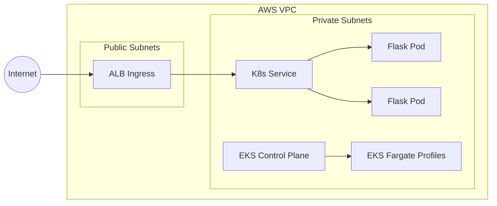

# DevOps take-home (Terraform-first)

This repository implements the case study with Terraform as the IaC tool of choice.

## Installation

1. Clone the repository.
2. Copy the Terraform variables template.
3. Initialize Terraform, run plan, and apply.

```bash
git clone https://github.com/REPLACE_WITH_YOUR_GITHUB_ORG/REPLACE_WITH_YOUR_REPO.git
cd REPLACE_WITH_YOUR_REPO
cp terraform/terraform.tfvars.example terraform/terraform.tfvars
make tf_init && make tf_plan && make tf_apply
```

## Reviewer quick start

Use these commands to validate the submission quickly:

```bash
make tf_init
make tf_validate
make tf_plan
kustomize build k8s/overlays/prod
```

Design intent:
- Treat Git as the source of truth for both infrastructure and delivery.
- Keep infrastructure and application image workflows separate.
- Make every change reviewable through CI before apply or push.

Why Terraform instead of CDK/CloudFormation:
- The case study is testing IaC fundamentals, not a specific framework syntax.
- Terraform still defines the full infrastructure declaratively in code, including the VPC, EKS Fargate cluster, and security groups.
- I chose the tool I am most fluent with so the implementation stays clear, reviewable, and easy to reason about.

## What is implemented

1. AWS infrastructure in Terraform (no custom modules)
- VPC with public/private subnets across 2 Availability Zones
- Internet Gateway, NAT Gateway, route tables
- EKS cluster
- EKS Fargate profiles (`default`, `kube-system`)
- IAM roles for cluster and Fargate pod execution
- Security groups/rules that capture required firewall behavior

2. Kubernetes manifests (Kustomize)
- Deployment for Flask app
- Service
- Ingress configured for AWS Load Balancer Controller (ALB)
- Kustomize base and production overlay

3. GitOps deployment via Argo CD
- `.github/workflows/app-image.yml` builds and pushes the container image to ECR
- `k8s/argocd/application.yaml` points Argo CD at the Kustomize prod overlay
- Argo CD syncs the cluster from Git and can self-heal drift
- The prod overlay uses a stable logical image name for the Flask application that is rewritten to the ECR repository by Kustomize
- Argo CD Image Updater annotations give the application an image alias, restrict updates to the CI tag pattern, and write the selected tag back to Git

4. GitHub Actions CI/CD
- `.github/workflows/config.yml`: Terraform fmt, init, validate, plan, artifact upload, and apply on push to `main`
- `.github/workflows/app-image.yml`: Docker build, Trivy scan, ECR repository check/create, and image push

## Repository structure

- `terraform/`: all AWS IaC resources
- `k8s/base/`: base Kubernetes deployment artifacts
- `k8s/overlays/prod/`: prod overlay via Kustomize
- `k8s/argocd/application.yaml`: Argo CD Application manifest
- `.github/workflows/config.yml`: Terraform CI/CD workflow
- `.github/workflows/app-image.yml`: application image build/scan/push workflow

## Security rules mapping

Required rules were translated into Terraform security groups as follows:

- Allow all egress: enabled on ALB, cluster, and pod/workload security groups
- Internet ingress:
	- TCP 80 from `0.0.0.0/0`
	- TCP 443 from `0.0.0.0/0`
	- ICMP from `0.0.0.0/0`
- Internal VPC traffic:
	- All TCP within `vpc_cidr`
	- All UDP within `vpc_cidr`

## Architecture diagram



## Prerequisites

- Terraform >= 1.6
- AWS CLI configured locally
- kubectl
- kustomize

## Local usage

1. Prepare Terraform inputs
- Copy `terraform/terraform.tfvars.example` to `terraform/terraform.tfvars`
- Edit values as needed

2. Validate and plan

```bash
make tf_init
make tf_fmt
make tf_validate
make tf_plan
```

3. Apply infrastructure

```bash
make tf_apply
```

4. Configure kubectl

Use the Terraform output command:

```bash
cd terraform && terraform output configure_kubectl
```

5. Render manifests

```bash
make k8s_render
```

6. Deploy manifests (after replacing placeholders)

Update placeholders in the manifest files first:
- `REPLACE_WITH_ECR_IMAGE_URI`
- `REPLACE_WITH_ALB_SECURITY_GROUP_ID`

Then apply:

```bash
kustomize build k8s/overlays/prod | kubectl apply -f -
```

## CI/CD behavior

Terraform workflow (`config.yml`):
- Runs on manual trigger (`workflow_dispatch`)
- Takes inputs: `action` (`plan`, `apply`, `destroy`) and `environment` (`staging`, `prod`)
- Uses Terraform workspace per environment for state isolation
- Applies environment-specific resource naming (for example, `max-fargate-cluster-staging`)
- Validates formatting, initialization, and configuration
- Runs `terraform plan` and saves a plan artifact
- Applies when the workflow is dispatched against `main`

Application image workflow (`app-image.yml`):
- Runs on `push` to `main` and `develop`
- Builds the Docker image
- Runs Trivy and fails on critical findings
- Ensures the ECR repository exists, then pushes the image with branch-aware tags

Argo CD deployment flow:
- Argo CD watches the Git repository, not the ECR registry directly
- When the image tag or digest in Git changes, Argo CD reconciles the cluster to that desired state
- Argo CD Image Updater bridges the registry and Git by polling ECR for new image tags and updating the Kustomize overlay in Git
- This repo uses immutable branch-aware tags from CI, for example `repo-name:e89a320-staging` and `repo-name:e89a320-prod`
- The updater can then select the newest matching build and write it back to the overlay so Argo CD deploys the updated image

### Path filter note (real-world practice)

In this demo repository, path filters reduce unnecessary image pipeline runs in a mixed app + infra repo.

In production, teams often split infrastructure and application code into separate repositories. In that setup, `git diff`-based change detection is usually a better trigger strategy than static path filters.

## Assumptions

- AWS authentication in GitHub Actions uses OIDC with `AWS_ROLE_TO_ASSUME` secret.
- Region is supplied via GitHub variable `AWS_REGION` (default fallback is `us-east-1`).
- AWS Load Balancer Controller is expected in cluster for Ingress reconciliation.
- Argo CD is assumed to already be installed in the cluster namespace `argocd`.
- Argo CD Image Updater is assumed to be installed if automated image promotion from ECR is desired.
- This implementation intentionally avoids extra modules and abstraction to keep the submission easy to review.

## Reliability posture

This design addresses the original incident by:
- Capturing network and cluster state declaratively in version control
- Enforcing reviewable infrastructure diffs via CI plan
- Enabling deterministic re-creation of deleted resources from source control
